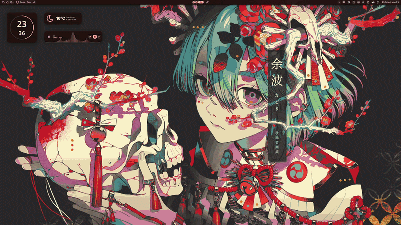

# 🐱 wap-kitty (only niri)

<p align="center">
  
</p>

<p align="center">
  
  
  
  
</p>

---

`wap-kitty` is a high-performance CLI automation utility written in Python that dynamically generates and applies harmonious, accessibility-first color schemes for the Kitty terminal based on your current desktop wallpaper. The project utilizes Google's advanced **Material 3 (M3) TonalSpot** quantization algorithm to mathematically calculate perfectly balanced color schemes.

Unlike traditional terminal theme generators (such as `pywal`) that blindly grab raw pixels or extract muddy, uncontrasted clusters, `wap-kitty` relies on the perceptual rigor of the **HCT (Hue, Chroma, Tone)** color space. Upon execution, it updates your configuration instantly and prints the active palette directly to `stdout` with clean, True Color terminal blocks.

---

## ✨ Key Features

<p align="center">
  
</p>

* 🧠 **M3 TonalSpot Engine:** Native generation of *Primary, Secondary, Tertiary, Neutral, and Error* palettes using Google's official C++ binaries compiled via `pybind11`.
* 👁️ **Contrast Enforcement:** Built-in compliance with perceptual readability standards (default contrast ratio of `3.0`) ensures your text never blends illegibly into the terminal background.
* 🎨 **Deep UI Theming:** Goes far beyond standard 16 ANSI overrides—it dynamically maps and themes your background, foreground, cursor, active text selections, window borders, and tab bars.
* ⚡ **Performance Optimized:** Wallpaper images are automatically downscaled to $128 \times 128$ before undergoing a hardware-accelerated k-means clustering process for instant execution.
* 🔄 **Zero-Click Automation:** Native systemd path units track live wallpaper modifications in `noctalia` on the fly, matching your terminal environment to your desktop without any user intervention.

---

## 📂 Project Architecture & File Tree

The project utilizes a modular Python design driven by a robust bash wrapper to eliminate system environment overhead:

```text
wap-kitty/
├── wap                  # Bash wrapper script (injects root into PYTHONPATH)
├── install.sh           # Automated dependency installer & symlink manager
├── README.md            # Comprehensive project documentation
├── .gitignore           # Explicitly filters __pycache__/ and *.pyc
├── systemd/
│   ├── wap-kitty.path   # Systemd Path unit (monitors wallpapers.json changes)
│   └── wap-kitty.service# Systemd Service unit (triggers the generator execution)
└── wap_kitty/
    ├── __init__.py      # Version metadata (1.0.0), exports main entry
    ├── __main__.py      # Execution gateway for python -m wap_kitty
    └── core.py          # Core logic (Wallpaper detection, M3 processing, config engine — 157 lines)
